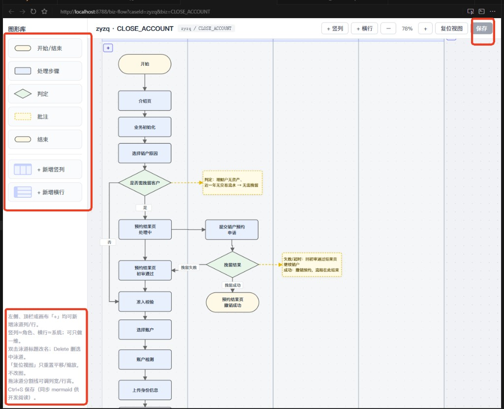

# biz-flow-gen · 业务流程图生成技能

口述流程或贴一张流程图截图 → 本地生成 `业务流程.md`（mermaid）→ 打开独立画布改图 → Ctrl+S 回写 mermaid。

不依赖特定业务仓库、`pnpm dev` 或开工单。本机只要 **Node.js** + **Cursor**。

## 效果示意



## 装到 Cursor

把本仓库克隆后，把整个目录复制为 `biz-flow-gen`：

| 范围 | 路径 |
|------|------|
| 本机所有工程 | `~/.cursor/skills/biz-flow-gen/`（Windows：`%USERPROFILE%\.cursor\skills\biz-flow-gen\`） |
| 只给某个仓库 | `<对方仓库>/.cursor/skills/biz-flow-gen/` |

拷完后目录里应有：`SKILL.md`、`技能使用说明.md`、`editor/`、`scripts/serve.mjs`。

## 对话里给齐三样

1. 口述流程，或流程图截图  
2. 落盘目录（建议绝对路径）  
3. 业务名（可省略）

示例：

```text
用业务流程图技能。流程：客户进介绍页 → 选销户原因 → 要挽留就进预约，否则准入校验 → 提交审核 → 结束。
落盘到 D:\demo\一站式销户，标题「一站式销户」。
```

## 产出

| 文件 | 作用 |
|------|------|
| `{目录}/业务流程.md` | mermaid，开发可读，Markdown 预览也能看 |
| `{目录}/biz-flow.json` | 画布坐标；保存后才有 |

编辑器链接形如：`http://127.0.0.1:8790/?dir={落盘目录}`

## 自己起编辑器

```bash
node scripts/serve.mjs --dir "D:\demo\一站式销户" --port 8790
```

端口占用换 `--port 8791`。

## 一期编辑能力

- 图形：开始/结束、处理、判定、批注  
- 泳道：竖列（角色）与横行（系统）可叠加；双击改名；拖分割线调宽高  
- 节点拖拽 / 方向键网格移动 / Shift 多选  
- 四边端口拉线、中段折弯、双击改连线文字  
- Ctrl+Z/Y、C/X/V、S；Delete；复位视图只改平移缩放  

完整说明见 [技能使用说明.md](./技能使用说明.md)，Agent 指令见 [SKILL.md](./SKILL.md)。

## License

MIT
