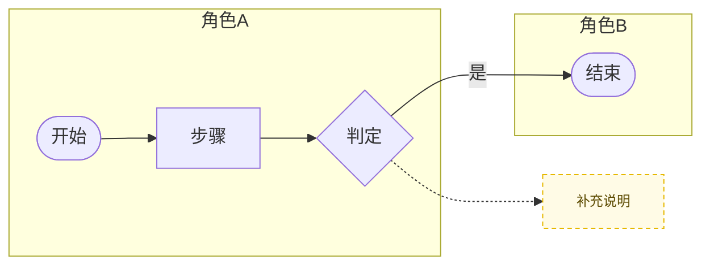

# 业务流程图生成

三项入料 → 落盘两个文件 → 回编辑器链接。同事工程只需 Node，不必 pull soc-prototype。

## 何时用

用户要画/生成/改业务流程图，并给了（或能追问到）落盘目录。不要用本仓库 `/biz-flow?caseId=&biz=`，不要起 `pnpm dev`。

## 三项入料（缺则追问，齐了再落盘）

1. **口述流程**，或 **流程图截图**（可两者都有）
2. **落盘目录**（对方工程里的任意路径，绝对路径优先）
3. **标题 / 业务名**（可选；缺省用目录名）

不要向用户要 caseId、开工单、bizCode。

## 两项产出（回复里必须同时给出）

1. **mermaid 文件**：`{落盘目录}/业务流程.md`
2. **编辑器链接**：`http://127.0.0.1:{port}/?dir={落盘目录}`（先用本技能 `scripts/serve.mjs` 拉起）

同目录还会写 `{落盘目录}/biz-flow.json`（画布坐标）。有 json 画布用坐标；没有则从 mermaid 解析。保存时两者一起写。

## 技能包位置

本 `SKILL.md` 所在目录即技能根（含 `editor/`、`scripts/serve.mjs`）。

若当前只有一份说明、编辑器在本机发布目录，用：

`D:\网厅需求演示系统\业务流程图生成技能`

启动（端口默认 8790，占用则 +1 再试）：

```bash
node "<技能根>/scripts/serve.mjs" --dir "<落盘目录>" --port 8790
```

打印出的 URL 原样发给用户。不要依赖 8788、本仓库 Vite、MCP。

## 落盘步骤

1. 确认三项入料。目录不存在就创建。
2. 按下面 mermaid 子集写 `{落盘目录}/业务流程.md`：一维**竖向角色泳道**即可。交叉矩阵留给用户在画布里加。
3. 若用户只要初稿、还没编辑过，**不要**手写 `biz-flow.json`；打开画布后由编辑器从 mermaid 解析并保存。
4. 启动 `serve.mjs`，回复里写：md 完整路径 + 编辑链接 + 一句「浏览器打开链接即可改图，Ctrl+S 回写 mermaid」。

### mermaid 文件骨架

```markdown
# {标题} · 业务流程

打开本文件后用 **Markdown Preview**（`Ctrl+Shift+V`）查看。


```

（上块最外层围栏在真实文件里只保留一层 mermaid 围栏。）

## mermaid 子集（只写这些，开发阅读用）

- `flowchart LR`（有角色列）或 `flowchart TD`（仅横向行）
- `classDef anno ...` 一行即可
- `subgraph id["泳道名"]` / `end`；泳道内 `direction TB` 或 `LR`
- 开始/结束：`id([文本])`
- 处理：`id["文本"]`，换行用 `<br/>`
- 判定：`id{文本}`
- 批注：`id["文本"]:::anno`（放在 subgraph 外）
- 实线：`a --> b` / `a -->|文案| b`
- 虚线（回炉/指向批注）：`a -.-> b` / `a -. 文案 .-> b`
- 链式：`a --> b --> c`
- 节点 id：字母开头的 `[A-Za-z_][\w-]*`，中文只放在标签里
- 不要用 mermaid 画交叉矩阵；矩阵用画布横行，导出时 mermaid 仍只保留竖列，横行写成 `%% row ...` 注释

## 一期编辑能力（生成初稿时按此边界；迭代只改本清单）

- 图形：开始/结束、处理、判定、批注
- 泳道：竖列（角色）与横行（系统）可叠加；可新增/删除；双击改名；拖分割线调列宽/行高
- 节点：拖拽、方向键按网格移动、Shift 多选
- 连线：四边端口拉线、中段拖折弯、双击编辑文字
- 快捷键：Ctrl+Z / Y、C / X / V、S；Delete
- 复位视图：只重置平移/缩放，不改图
- 保存：回写 mermaid（给开发阅读，一维为主）+ json（编辑器位置）

## 仍不要做

- 不要做 MCP、不要做截图 OCR 服务
- 不要要求同事 pull / 打开 soc-prototype
- 不要把交叉泳道硬编码进 mermaid 正文
